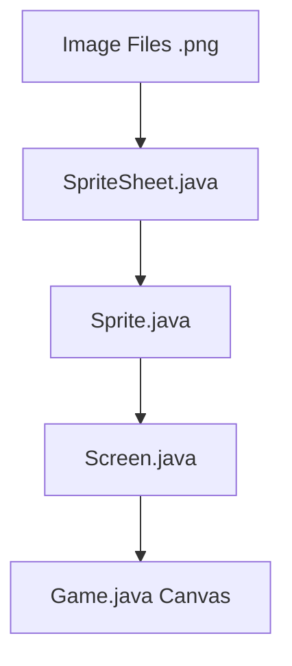

# Graphics & Tile Rendering Guide

This document explains how the Smart Farm Simulator manages images and draws tiles to the screen using a custom software renderer.

## 1. The Asset Pipeline

The rendering system follows a strict hierarchy for processing graphics:

### Step A: Loading the SpriteSheet

`SpriteSheet.java` is responsible for loading the raw image files (like `Outdoor.png`) from the resources folder.

- It uses `ImageIO.read` to load the image into a `BufferedImage`.
- It immediately converts that image into an **integer array** of pixels (`int[] pixels`).
- Each integer represent a color in **ARGB** format.

### Step B: Extracting Sprites

`Sprite.java` represents a single 16x16 (or other size) tile.

- When you define a sprite (e.g., `Sprite.grass`), you provide the coordinates on the sheet (x, y).
- The Sprite class goes to the `SpriteSheet`'s pixel array and "clips" out the specific pixels for that tile.
- These pixels are stored in the sprite's own `int[] pixels` array.

## 2. Drawing to the Screen

The `Screen.java` class acts as the "Virtual Screen." It contains a large pixel array that matches the game's internal resolution (400x225).

### Rendering Logic

When `screen.renderSprite(x, y, sprite)` is called:

1. It loops through every pixel in the `Sprite`.
2. It ignores **Pink (0xffff00ff)**, which is treated as a transparent color.
3. It copies the relevant colors into the `Screen.pixels` array at the target coordinates.

## 3. The Final Display

In `Game.java`, there is a `BufferedImage` linked directly to the `Screen`'s pixel array.

1. **Update**: The simulation logic runs (crops grow, moisture changes).
2. **Render**:
   - `screen.clear()`: Wipes the screen black.
   - `renderGrid()`: Loops through the `FarmGrid` and tells the `Screen` to draw the corresponding tile (soil, crop Stage, pests) for every cell.
   - `renderHUD()`: Draws text and icons on top.
3. **Graphics.drawImage()**: The final pixel array is drawn onto the Java `Canvas` and scaled up (typically 4x) to fit your window.

> [!TIP]
> This "Software Renderer" approach is very efficient for 2D grid games because it minimizes calls to the GPU and allows for pixel-perfect manipulation of every tile.
